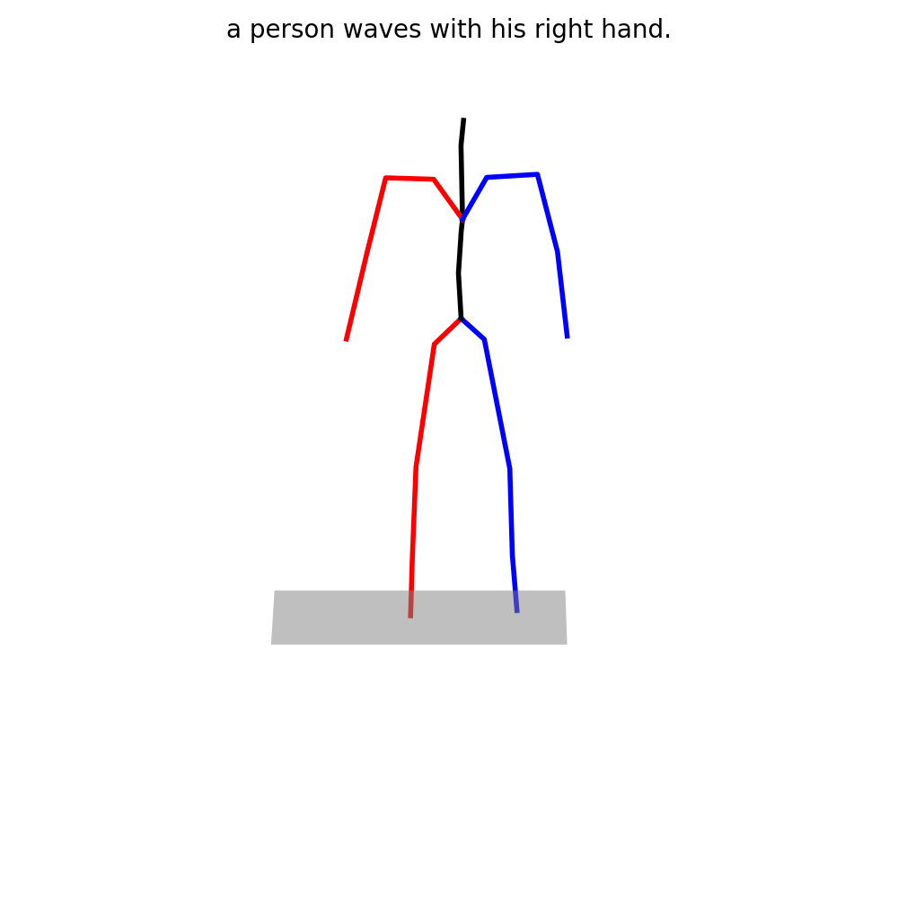

# StableMoFusion: Towards Robust and Efficient Diffusion-based Motion Generation Framework

<!-- [](https://h-y1heng.github.io/StableMoFusion-page/)

[](https://steve-zeyu-zhang.github.io/MotionMamba/) 
[](https://arxiv.org/abs/2403.07487) [](https://huggingface.co/papers/2403.07487)  -->


The official PyTorch implementation of the paper [**"StableMoFusion: Towards Robust and Efficient Diffusion-based Motion Generation Framework"**](https://arxiv.org/abs/2405.05691). [Project Page](https://h-y1heng.github.io/StableMoFusion-page/)

<!-- StableMoFusion is a diffusion-based text-to-motion generation framework, -->

<!-- ## News -->

## Get Start

This code was tested on `NVIDIA GeForce RTX A100` and requires:

* conda3 or miniconda3


a. Create a conda virtual environment and activate it.

```shell
conda create -n stablemofusion python=3.8 -y
conda activate stablemofusion
```

b. Install PyTorch 1.10.0 following the [official instructions](https://pytorch.org/).
```shell
conda install pytorch==1.10.0 torchvision==0.11.0 torchaudio==0.10.0 cudatoolkit=11.3 -c pytorch -c conda-forge 
```

**Important:** Make sure that your compilation CUDA version and runtime CUDA version match.

c. Install other requirements

```shell
pip install -r requirements.txt
```

d. Install ffmpeg for visualization
```shell
conda install ffmpeg x264=20131218 -c conda-forge
```

e. Modify the `LayerNorm` module in clip for fp16 inference
```python
# miniconda3/envs/stablemofusion/lib/python3.8/site-packages/clip/model.py
class LayerNorm(nn.LayerNorm):
    """Subclass torch's LayerNorm to handle fp16."""

    def forward(self, x: torch.Tensor):
        if self.weight.dtype==torch.float32:

            orig_type = x.dtype
            ret = super().forward(x.type(torch.float32)) 
            return ret.type(orig_type)  
        else:
             return super().forward(x)
```
 
## Quick Start
1. Download pre-trained models from [Google Cloud](https://drive.google.com/drive/folders/1o3h0DHEz5gKG-9cTdl3lUEwjwW51Ay81?usp=sharing) and put them into ./ckeckpoints/ and arrange them in the following file structure:
```text
StableMoFusion
├── checkpoints
│   └── kit
│       └── kit_condunet1d_batch64
│           ├── meta
│           │   ├── mean.npy
│           │   └── std.npy
│           ├── model
│           │   └── latest.tar
│           └── opt.txt
│   └── t2m
│       └── t2m_condunet1d_batch64
│           ├── meta
│           │   ├── mean.npy
│           │   └── std.npy
│           ├── model
│           │   └── latest.tar
│           └── opt.txt
│   └── footskate
│       ├── underpressure_pretrained.tar
│       └── t2m_pretrained.tar  
```
2. Download the [UnderPressure code](https://github.com/InterDigitalInc/UnderPressure) and put them into ./UnderPressure/ like:
```
StableMoFusion
├── UnderPressure
│   ├── dataset
│   |   |── S1
│   |   |── S2
│   |   └── ...
│   ├── anim.py
│   ├── data.py
│   ├── demo.py
│   └── ...
```
3. Updating import paths within `./Underpressure/*.py`. 
To ensure modules within the ./Underpressure/ can be imported and utilized seamlessly via python -m, it's necessary to update the import paths within the Python files located in ./Underpressure/*.py. For example:
* Replace `import util` with `from Underpressure import util` in UnderPressure/anim.py
* Replace `import anim, metrics, models, util`  with `from UnderPressure import anim, metrics, models, util` in UnderPressure/demo.py
4. run demo.py or scripts/generate.py 
```shell
# generate from a single prompta
# e.g. generate a 4-second wave motion . Unit of `--motion_length` is seconds.
python -m scripts.generate --text_prompt "a person waves with his right hand." --motion_length 4 --footskate_cleanup

# Generate from your text file
# e.g. generate 5 motions by different prompts in .txt file, and set the motion frame length separately by .txt file. Unit of `--input_len` is frame.
python -m scripts.generate  --footskate_cleanup  --input_text ./assets/prompts.txt --input_lens ./asserts/motion_lens.txt
# e.g. generate 5 motions by different prompts in .txt file with the same motion length.
python -m scripts.generate  --footskate_cleanup --input_text ./assets/prompts.txt --motion_length 4

# Generate from test set prompts
# e.g. Randomly selecting 10 prompts in test set to generate motions
python -m scripts.generate --num_samples 10
```

**You may also define :**

* `--device` id.
* `--diffuser_name` sampler type in diffuser (e.g. 'ddpm','ddim','dpmsolver'), related settings see [./config/diffuser_params.yaml](config/diffuser_params.yaml)
* `--num_inference_steps` number of iterative denoising steps during inference
* `--seed` to sample different prompts.
* `--motion_length`  in seconds .
* `--opt_path` for loading model
* `--footskate_cleanup` to use footskate module in the diffusion framework

**You will get :**

* `output_dir/joints_npy/xx.npy` - xyz pose sequence of the generated motion
* `output_dir/xx.mp4` - visual animation for generated motion.

outputdir is located in the ckeckpoint dir like `checkpoints/t2m/t2m_condunet1d_batch64/samples_t2m_condunet1d_batch64_50173_seed0_a_person_waves_with_his_right_hand/`.

The visual animation will look something like this:



##  Train and Evaluation

### 1. Download datasets 

**HumanML3D** - Follow the instructions in [HumanML3D](https://github.com/EricGuo5513/HumanML3D.git),
then copy the result dataset to our repository:

```shell
cp -r ../HumanML3D/HumanML3D ./data/HumanML3D
```

**KIT** - Download from [HumanML3D](https://github.com/EricGuo5513/HumanML3D.git) (no processing needed this time) and the place result in `./data/KIT-ML`
</details>

### 2. Download pretrained weights for evaluation
We use the same evaluation protocol as [this repo](https://github.com/EricGuo5513/text-to-motion). You should download pretrained weights of the contrastive models in [t2m](https://drive.google.com/file/d/1DSaKqWX2HlwBtVH5l7DdW96jeYUIXsOP/view) and [kit](https://drive.google.com/file/d/1tX79xk0fflp07EZ660Xz1RAFE33iEyJR/view) for calculating FID and precisions. To dynamically estimate the length of the target motion, `length_est_bigru` and [Glove data](https://drive.google.com/drive/folders/1qxHtwffhfI4qMwptNW6KJEDuT6bduqO7?usp=sharing) are required.

Unzipped all files and arrange them in the following file structure:

```text
StableMoFusion 
└── data
    ├── glove
    │   ├── our_vab_data.npy
    │   ├── our_vab_idx.pkl
    │   └── out_vab_words.pkl
    ├── pretrained_models
    │   ├── kit
    │   │   └── text_mot_match
    │   │       └── model
    │   │           └── finest.tar
    │   └── t2m
    │   │   ├── text_mot_match
    │   │   │   └── model
    │   │   │       └── finest.tar
    │   │   └── length_est_bigru
    │   │       └── model
    │   │           └── finest.tar
    ├── HumanML3D
    │   ├── new_joint_vecs
    │   │   └── ...
    │   ├── new_joints
    │   │   └── ...
    │   ├── texts
    │   │   └── ...
    │   ├── Mean.npy
    │   ├── Std.npy
    │   ├── test.txt
    │   ├── train_val.txt
    │   ├── train.txt
    │   └── val.txt
    ├── KIT-ML
    │   ├── new_joint_vecs
    │   │   └── ...
    │   ├── new_joints
    │   │   └── ...
    │   ├── texts
    │   │   └── ...
    │   ├── Mean.npy
    │   ├── Std.npy
    │   ├── test.txt
    │   ├── train_val.txt
    │   ├── train.txt
    │   └── val.txt
```

### 3. Train CondUnet1D Model
<details>
  <summary><b>HumanML3D</b></summary>

```shell 
accelerate launch --config_file 1gpu.yaml --gpu_ids 0 -m scripts.train --name t2m_condunet1d --model-ema --dataset_name t2m
```
</details>

<details>
  <summary><b>KIT-ML</b></summary>

```shell 
accelerate launch --config_file 1gpu.yaml --gpu_ids 0 -m scripts.train --name kit_condunet1d --model-ema --dataset_name kit
```
</details>

You may also define the `--config_file` for training on multi gpus.


### 4. Evaluate

<details>
  <summary><b>HumanML3D</b></summary>
```shell
python -m scripts.evaluation --opt_path ./checkpoints/t2m/t2m_condunet1d_batch64/opt.txt 
```
The evaluation results will be saved in `./checkpoints/t2m/t2m_condunet1d_batch64/eval`
</details>

<details>
  <summary><b>KIT-ML</b></summary>
```shell
python -m scripts.evaluation --opt_path ./checkpoints/kit/kit_condunet1d_batch64/opt.txt 
```

The evaluation results will be saved in `./checkpoints/kit/kit_condunet1d_batch64/eval`
</details>

### Train your own vGRF model for footskate cleanup
Download [smplh](http://mano.is.tue.mpg.de) to folder `./data/smplh` and run train_UnderPressure_model.py
```shell 
python -m scripts.train_UnderPressure_model --dataset_name t2m
```
</details>

## Acknowledgments

This code is standing on the shoulders of giants. We want to thank the following contributors
that our code is based on:

[text-to-motion](https://github.com/EricGuo5513/text-to-motion), [MDM](https://github.com/GuyTevet/motion-diffusion-model), [MotionDiffuse](https://github.com/mingyuan-zhang/MotionDiffuse), [GMD](https://github.com/korrawe/guided-motion-diffusion).

## License
This code is distributed under an [MIT LICENSE](LICENSE).

Note that our code depends on other libraries, including CLIP, Diffusers, SMPL-X, PyTorch3D, ... and uses datasets that each have their own respective licenses that must also be followed.
